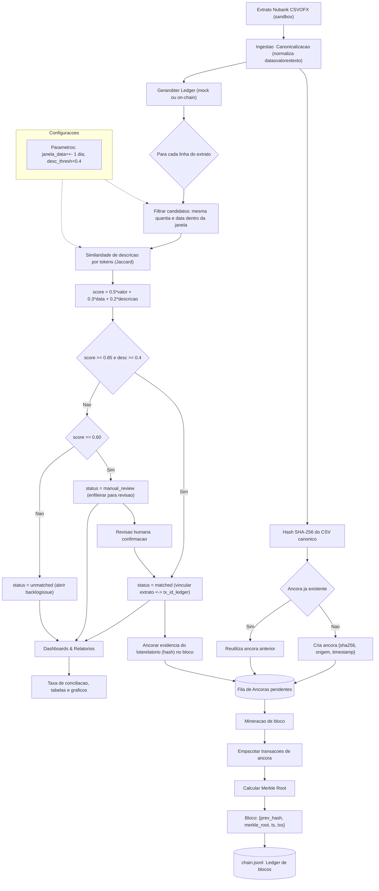

# Blockchain-ONGs-Integration-Sim

Pipeline de integração “quase real” para ONG: extrato (mock/CSV) → ingestão/canonicalização → conciliação → ancoragem on-chain simulada (Merkle + blocos) → dashboards.

Sem credenciais, sem dados sensíveis. Simula coleta automatizada (emissão para `data/inbox/`), processamento e publicação de âncoras.

## Executar

1) Ativar venv (se necessário):
   `..\.venv\Scripts\Activate.ps1`

2) Rodar pipeline completo:
   `python -m blockchain_ong_sim.cli run-all`

Artefatos:
- `data/inbox/` — extratos emitidos automaticamente
- `data/processed/` — CSV canônicos
- `data/anchors/` — âncoras (hashes e metadados)
- `data/ledger/` — ledger mock
- `data/conciliation/` — conciliações
- `chain/chain.jsonl` — blockchain simulada (blocos com Merkle)
- `out/` — imagens de dashboards (PNG)

## Comandos
- `emit-extract` — cria extrato CSV no inbox (mock/Nubank sandbox)
- `ingest` — canonicaliza CSV → `processed/` e gera âncora → `anchors/`
- `reconcile` — concilia extrato canônico com ledger mock → `conciliation/`
- `anchor` — cria bloco com Merkle root e inclui âncoras pendentes → `chain.jsonl`
- `render-dashboards` — gera prints (extrato + conciliação)
- `run-all` — executa tudo na ordem

## Observações
- Blockchain simulada: blocos com `prev_hash`, `merkle_root`, `block_hash`; sem rede P2P real.
- Sem LGPD: dados sintéticos; não publicar segredos.

## Interface gráfica (GUI)
- Executável Windows: `dist/ONGTransparency.exe` (login: `UserAdmin1` / `Admin1234`).
- Rodar da fonte: `python app_gui.py` (usa Tkinter). Após login, a UI abre maximizada, com abas para visualizar Extrato, Conciliação e Relatório, além de área Admin para gerenciar usuários.

## Dependências
Instale as dependências (modo desenvolvimento):

```
pip install -r requirements.txt
```

Para empacotar o executável (opcional):

```
pyinstaller --noconsole --onefile --name ONGTransparency app_gui.py
```

## Fluxo da Regra de Negócios (Mermaid)



Versão PNG estática: veja `docs/fluxo_regra_negocio.png`.


